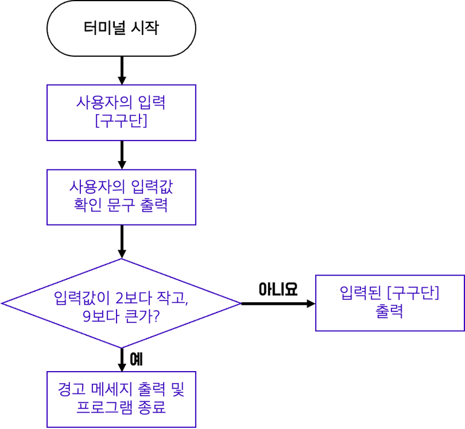

💡 구구단 프로그램 만들기

가장 기본적인 연산 방식이지만 이를 프로그램으로 만들기는 그리 간단하지 않습니다.
사용자가 입력한 값에 맞는 구구단을 제어문과 반복문을 활용하여 프로그램을 만들어 주세요.

## 🖥  [구구단 프로그램] 실행 결과 예시
본 예시는 사용자의 입력에 따른 두 가지 출력 결과 입니다.
**✅ 사용자의 입력이 프로그램 기획에 부합한 경우**
```
[안내]희망하는 구구단을 숫자로 입력해 주세요 (2 ~ 9) : 9

9 단 이 입력되었습니다.
9 * 1 = 9
9 * 2 = 18
9 * 3 = 27
9 * 4 = 36
9 * 5 = 45
9 * 6 = 54
9 * 7 = 63
9 * 8 = 72
9 * 9 = 81
```

**❌ 사용자의 입력이 프로그램 기획에 부합하지 않은 경우**
```
[안내]희망하는 구구단을 숫자로 입력해 주세요 (2 ~ 9) : 10

10 단 이 입력되었습니다.
[경고]구구단은 2단 ~ 9단 까지만 선택할 수 있습니다.
프로그램을 종료합니다.
```

## 💡 구구단 협회에서 내려온 프로그래밍 요청서
**✏️ 프로그램 설계도 작성**
이번 프로그램은 사용자의 입력이 포함되어 있습니다. 그렇기에 프로그램 기획과 맞지 않는 값이 입력될 가능성은 충분합니다.
사용자가 입력한 값의 범위가 다음과 같을 때를 고려한 프로그램 설계도를 먼저 작성하여 주세요.
→ 사용자의 입력값이 2 보다 작을 때
→ 사용자의 입력값이 9 보다 클 때

구구단 프로그램은 다음과 같은 설계도를 그려볼 수 있습니다. 이후 더 복잡한 과정이 포함된 프로그램을 설계하게 된다면 이와 같이 설계도 혹은 코드의 흐름을 알 수 있는 자신만의 표를 그려 도움을 받아 볼 수 있습니다.



## 🛠 [코드스테이츠]에서 내려온 프로그래밍 참고사항
**⚙ 위 내용은 어떻게 코딩할 수 있을까요?**
프로그램의 순서도에 따라 사용자의 입력을 받기 위한 Scanner 객체가 필요한 상황입니다. 더불어 사용자의 입력은 2 ~ 9 사이의 값인 정수를 입력받아야 하기에 그에 맞는 메서드가 필요한 상황입니다. (※ Scanner를 사용했다면 close() 메서드를 통해 사용 종료를 선언해 주세요.)

그리고 사용자가 입력한 값을 확인할 수 있는 안내 문자가 필요해 보입니다. 이는 print(), printf(), println() 을 적절하게 사용하여 주세요.

순서도의 중간에 있는 입력값이 2보다 작고, 9보다 큰가? 를 프로그래밍 하기 위해 제어문과 논리 연산자가 필요해 보입니다. 더불어 사용자가 입력한 값 에 맞는 출력을 하기 위한 반복문도 필요해 보이는 상황입니다.

**🚨 하드코딩은 피해주세요!**
프로그래밍을 처음 시작하면 자신도 모르게 데이터 값을 소스 코드 내부에 직접 넣어 프로그래밍을 진행합니다. 예를 들어 입력값(dan)이 2보다 작고 9보다 큰가? 를 하드코딩하게 되면 if(2 > dan || dan > 9) 처럼 데이터 2와 데이터 9를 소스코드에 넣을 수 있습니다.

이와 같은 방식은 코드가 길어지면 협업하는 과정에서 가독성이 떨어지며, 유지보수가 힘들어 집니다. 그렇기에 되도록 하드코딩 방식이 아닌 변수를 생성하여 코딩을 진행해 주세요.